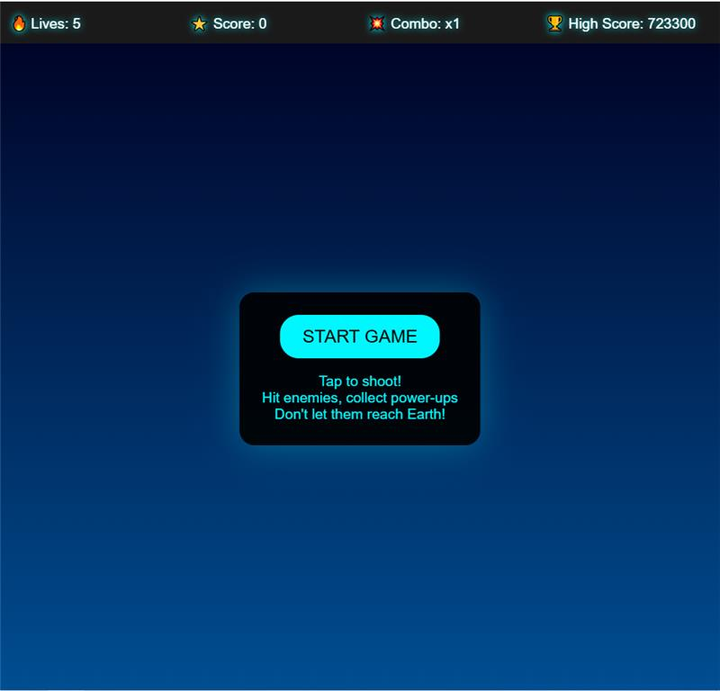

# Galaxy Defender 🚀👾

<div align="center">
  <a href="https://github.com/Owono2001/galaxy-defender">     
  </a>
  <p style="font-family: 'Space Mono', monospace; color: #7DF9FF; font-size: 1.2em;">Attention Pilot! Your visit fuels the fleet! 🔥</p>
</div>

<div align="center">

**Blast your way through endless waves of alien invaders in this classic arcade-style shooter! Take command of your starfighter, dodge enemy fire, grab powerful upgrades, and aim for the highest score!**

</div>

---

<p align="center">
  
</p>

---

## ✨ Features

* 💥 **Intense Click-to-Shoot Action:** Obliterate enemy ships with precise laser fire activated by your clicks.
* ⚡ **Strategic Power-Ups:** Turn the tide of battle! Grab essential upgrades like:
    * 🛡️ **Shields:** Absorb incoming damage for a limited time.
    * 🔥 **Rapid Fire:** Unleash a devastating barrage of lasers.
    * ✨ **Combo Boosters:** Amplify your score potential.
* 💯 **Score-Boosting Combos:** Chain destruction! Annihilate enemies consecutively to build up massive combo multipliers.
* 🏆 **High Score Pursuit:** Track your personal best and strive to become the ultimate Galaxy Defender.
* 📱 **Responsive Design:** Play seamlessly whether you're on a desktop monitor or defending the galaxy on the go.

---

## 🛠️ Tech Stack

* **Frontend:** React
* **Styling:** CSS / (Specify if you used CSS Modules, Tailwind, Styled Components etc.)
* **Build Tool:** Create React App (implied)

---

## 🚀 Getting Started

### Prerequisites

* Node.js (v16 or later recommended)
* npm (usually comes with Node.js)

### Installation

1.  **Clone the repository:**
    ```bash
    git clone [https://github.com/YOUR-USERNAME/YOUR-REPO-NAME.git](https://github.com/YOUR-USERNAME/YOUR-REPO-NAME.git)
    cd YOUR-REPO-NAME
    ```
    *(Replace `YOUR-USERNAME/YOUR-REPO-NAME` with your actual GitHub username and repository name)*

2.  **Install dependencies:**
    ```bash
    npm install
    ```

### Running the App

1.  **Start the development server:**
    ```bash
    npm start
    ```
    This will usually open the game in your default browser at `http://localhost:3000`.

2.  **Build for production:**
    ```bash
    npm run build
    ```
    This creates an optimized build of your app in the `build` folder.

---

## ☁️ Deployment

This project is a static web application and can be easily deployed to various hosting services:

* **[Vercel](https://vercel.com):** Excellent for React projects, offers seamless Git integration and free tier.
* **[Netlify](https://netlify.com):** Another popular choice with great features, CI/CD, and a generous free tier.
* **[GitHub Pages](https://pages.github.com/):** Free hosting directly from your GitHub repository. You might need to configure the `homepage` field in your `package.json` and adjust build paths.
* Other static hosting providers (AWS S3, Google Cloud Storage, etc.)

---

## 🤝 Contributing

Contributions make the galaxy safer! Pull requests are welcome. For major changes or new features, please open an issue first to discuss what you would like to change.

1.  Fork the Project
2.  Create your Feature Branch (`git checkout -b feature/AmazingFeature`)
3.  Commit your Changes (`git commit -m 'Add some AmazingFeature'`)
4.  Push to the Branch (`git push origin feature/AmazingFeature`)
5.  Open a Pull Request

---

## 📜 License

Distributed under the MIT License. See `LICENSE` file (or the link below) for more information.

[MIT License](https://choosealicense.com/licenses/mit/)

---

<div align="center">
  <p>Happy Defending! 🌠</p>
</div>
